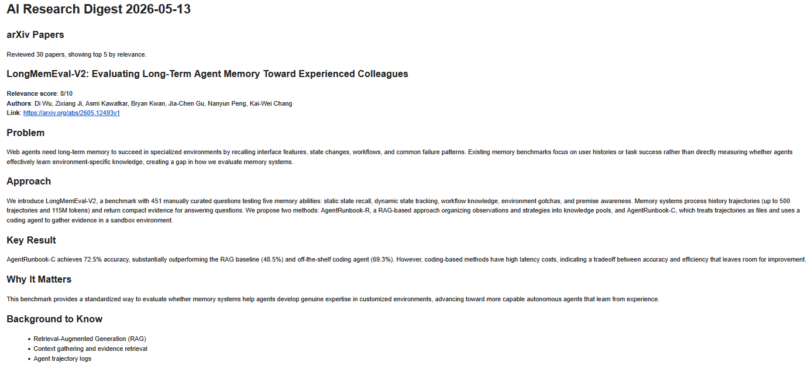
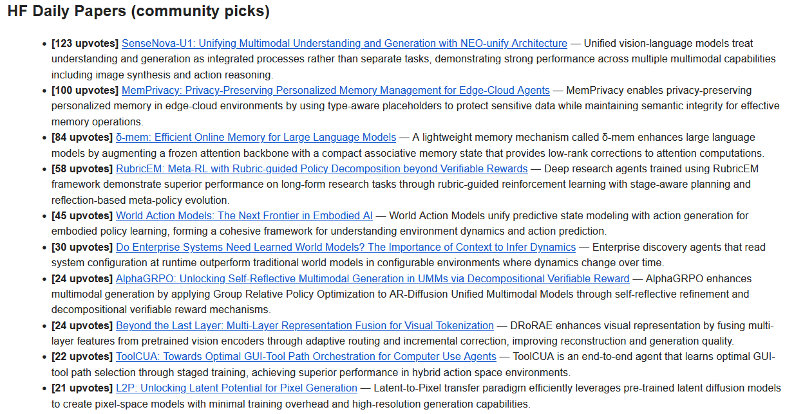
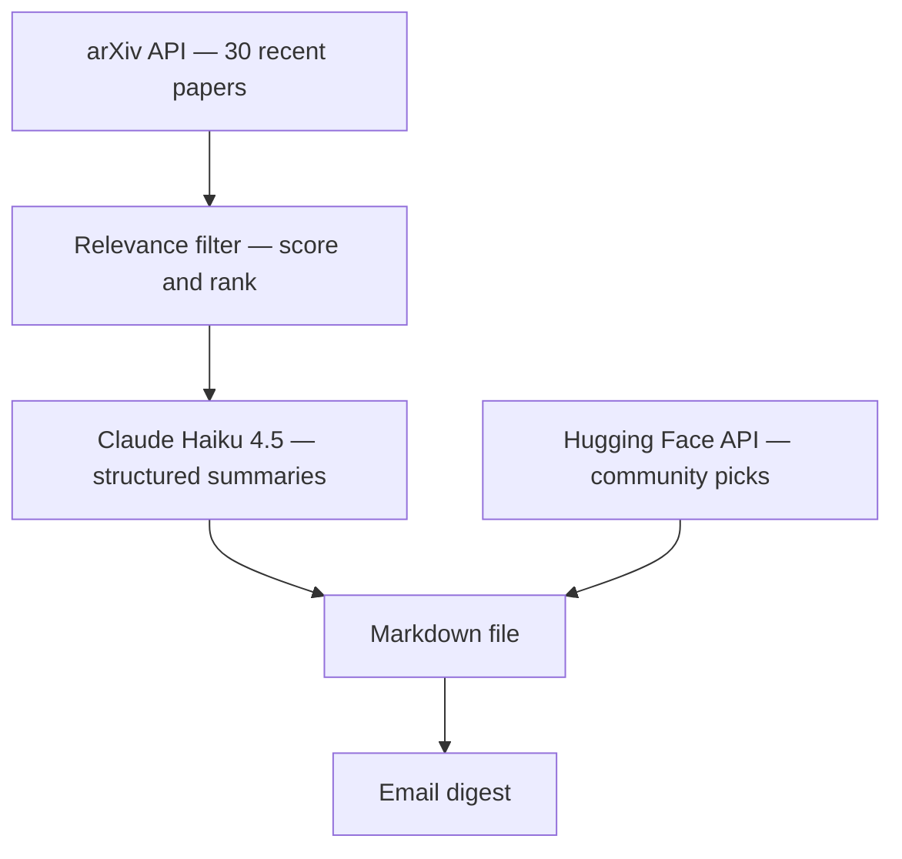

# AI Research Digest Agent

An automated daily pipeline that curates, filters, and summarises AI research papers based on my interests, and emails me the digest every morning.

## What it does

Every morning, this agent automatically:

- Fetches 30 recent papers from arXiv (cs.AI, cs.LG, cs.CL)
- Scores each for relevance using a two-stage LLM filter calibrated to my interests and knowledge level
- Summarises the top 5 with structured output (Problem, Approach, Key Result, Why It Matters, Background to Know)
- Pulls the top 10 community-voted papers from Hugging Face Daily Papers
- Saves everything to a dated Markdown file and emails the digest to my inbox

The arXiv section is personalised — papers are filtered based on my specific interests. The Hugging Face section is community-curated — showing what the broader AI community is paying attention to today.

## Example output





## Architecture



## Setup

1. Clone the repo:
   ```bash
   git clone https://github.com/ashrafbadalof/ai-news-agent.git
   cd ai-news-agent
   ```

2. Install dependencies:
   ```bash
   pip install -r requirements.txt
   ```

3. Create a `.env` file with your API keys:
   ```
   ANTHROPIC_API_KEY=your-anthropic-api-key
   EMAIL_APP_PASSWORD=your-gmail-app-password
   SENDER_EMAIL=your-email@gmail.com
   RECIPIENT_EMAIL=your-email@gmail.com
   ```

4. Run:
   ```bash
   python main.py
   ```

To schedule daily runs on Windows, create a Task Scheduler entry pointing to `python main.py` with the project folder as the working directory.

## What I learned

Before this project, I had no practical experience with APIs. Building this taught me how to integrate external services, iterate on prompts until they produce consistent output, and think about cost, like filtering cheaply before spending on full summarisation. The biggest lesson was the gap between "it works when I run it" and "it works on its own every morning."

## Future plans

- Deploy to GitHub Actions for cloud-based scheduling (runs even when laptop is off)
- Build a Streamlit dashboard to browse past digests
- Deduplicate papers appearing in both arXiv and HF sources
- Train a personal relevance classifier on my own reading data over time